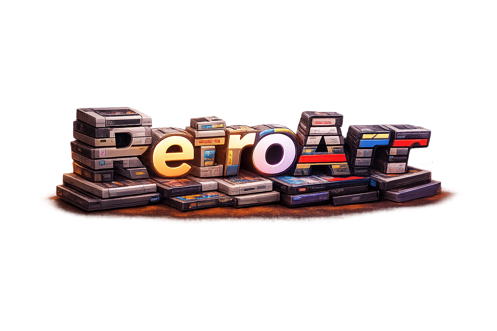

<p align="center">
  
</p>

<p align="center">
  <strong>Self-hosted game library manager for PC and retro consoles.</strong>
</p>

<p align="center">
  <a href="https://RetroArr.app"></a>
  <a href="https://opensource.org/licenses/MIT"></a>
  <a href="https://github.com/RiDDiX/RetroArr/pkgs/container/retroarr"></a>
  <a href="https://github.com/RiDDiX/RetroArr/releases"></a>
</p>

---

Think Radarr/Sonarr, but for video games. RetroArr scans your library, fetches metadata, organizes files, searches indexers, and automates downloads — across PC, retro consoles, handhelds, and arcade platforms. One tool, one UI.

## Quick Start

```yaml
# docker-compose.yml
services:
  retroarr:
    image: ghcr.io/riddix/retroarr:latest
    container_name: retroarr
    ports:
      - "2727:2727"      # HTTP
      - "2728:2728"      # HTTPS (optional, self-signed cert)
    volumes:
      - ./config:/app/config
      - /your/games/path:/media
      - ./savestates:/app/savestates
    environment:
      - PUID=1000
      - PGID=1000
      - RETROARR_HTTPS_PORT=2728   # remove to disable HTTPS
    restart: unless-stopped
```

```bash
docker compose up -d
```

Open `http://your-ip:2727` (or `https://your-ip:2728`), then **Settings → Metadata** and paste your [IGDB credentials](https://api-docs.igdb.com/#getting-started) (free, Twitch dev account).

## HTTP or HTTPS?

Both are served by the same container. Pick what fits your setup:

- **HTTP on `:2727`** — fine for localhost, or when you already have a reverse proxy (SWAG, Traefik, Caddy, nginx) handling TLS
- **HTTPS on `:2728`** — auto-generated self-signed cert on first start, stored in `config/certs/retroarr.pfx`. Required for threaded emulator cores (PSP, NDS, N64, Saturn, 3DO) when you access the UI from a LAN IP — browsers only expose `SharedArrayBuffer` on secure origins

If you only plan to proxy through SWAG with a real cert, drop the `2728` line from `ports:` and the `RETROARR_HTTPS_PORT` env var.

## Features

**Library & scanning**
- Identifies files across **170 platforms** from `PlatformDefinitions.cs` — PC, every PlayStation, every Xbox, Nintendo NES through Switch 2, Sega from SG-1000 to Dreamcast, Atari, NEC, Arcade (MAME, FBNeo, CPS, Neo Geo), ScummVM, DOSBox, a pile of obscure handhelds and 8-bit computers
- Metadata from **IGDB** (primary), **ScreenScraper** (retro and arcade fallback), **Steam**, and **GOG**
- PlayStation serial extraction (SCES/SCUS/SLUS/SLES/CUSA/PPSA/…) so the title gets cleaned and metadata finds the right entry
- Nintendo Switch Title ID parsing (base vs patch vs DLC via bit flags)
- Region, language and revision tags parsed from filenames
- Multi-file games: `.cue` + `.bin`, `.m3u` for multi-disc, `.gdi` tracks, folder-based PS3/Wii U, `.chd`, `.nsz`/`.xcz`
- Rescan heals wrong platforms by re-reading the path, deduplicates after folder moves

**Downloads & indexers**
- Indexer backends: **Prowlarr**, **Jackett**, **Hydra Launcher**, plus raw **Newznab**/**Torznab**
- Download clients: **qBittorrent**, **Transmission**, **Deluge**, **SABnzbd**, **NZBGet**
- Post-download handler picks the right platform folder, renames, attaches patches/DLC to the right game

**Launching**
- Steam and GOG launch directly through their clients when the game is installed there
- Native executable discovery for installed PC games
- Linux: Proton/Wine auto-detection, per-game runner override, Lutris config export, Steam shortcut export, `.desktop` file generation
- macOS: opens via `/usr/bin/open`, delegates to Whisky/CrossOver when present

**Emulation**
- Browser-based retro emulation via [EmulatorJS](https://emulatorjs.org/) — 25 cores wired up (NES/SNES/N64/GB/GBC/GBA/NDS/VB, Genesis/Master System/Game Gear/Saturn/32X/Sega CD, PS1/PSP, Atari 2600/5200/7800/Lynx/Jaguar, Arcade, PCEngine)
- BIOS drop folder at `/app/config/bios` — whitelisted filenames served to EmulatorJS on demand
- Save states: 8 slots per game, upload/download/delete from the UI, stored in `/app/savestates`

**UI & integrations**
- Retro-themed interface with CRT boot animation, platform-accent color tinting, keyboard d-pad navigation
- 7 UI languages (English, German, Spanish, French, Russian, Chinese, Japanese)
- Plugin system: process-isolated, language-agnostic, with circuit breaker and JSON stdin/stdout
- Webhook notifications (Discord-compatible) with in-UI test button
- Nintendo Switch USB transfer via DBI protocol (Python helper ships with the container)
- Real-time scan / download / health status over SignalR — LIVE badge in the sidebar

**Storage & deployment**
- Database: **SQLite** (default), **PostgreSQL**, or **MariaDB** — migration between them is a guided flow in Settings → Database
- Optional **Redis** cache
- Structured logging, per-feature log files, rotation, one-click diagnostics export
- Docker image runs as non-root, has a `HEALTHCHECK`, works on `amd64` + `arm64`

**Security**
- Every stored credential (IGDB, ScreenScraper, download clients, Steam, Prowlarr, Jackett, GOG) encrypted with ASP.NET Data Protection. Plaintext values from older installs get migrated on first save
- API key gate: loopback requests are unauthenticated (for the Docker healthcheck), LAN and remote clients need `X-Api-Key`. Key is shown and rotatable in Settings → API access
- EmulatorJS static assets and the `/emulator/player` page are exempt from auth, since browsers can't attach API keys to `<script src>` or iframe loads

Deeper reads: [Linux Gaming](docs/LINUX_GAMING.md) · [Plugins](docs/PLUGIN_GUIDE.md) · [Scanner Logic](docs/SCANNING_LOGIC.md) · [Updates & DLC](docs/UPDATES_DLC_GUIDE.md) · [Launcher Specs](docs/LAUNCHER_SPECS.md) · [Installer Logic](docs/INSTALLER_LOGIC.md)

## Installation

### Docker (recommended)

See [Quick Start](#quick-start). HTTP on **2727**, optional HTTPS on **2728**.

<details>
<summary><strong>CasaOS</strong></summary>

**App Store → Custom Install → Import**, then paste:

```yaml
services:
  RetroArr:
    image: ghcr.io/riddix/retroarr:latest
    container_name: RetroArr
    network_mode: bridge
    ports:
      - "2727:2727"
      - "2728:2728"
    volumes:
      - /DATA/AppData/RetroArr/config:/app/config
      - /DATA/Media:/media
    environment:
      - DOTNET_RUNNING_IN_CONTAINER=true
      - RETROARR_HTTPS_PORT=2728
      - PUID=1000
      - PGID=1000
    restart: unless-stopped

x-casaos:
  architectures: [amd64, arm64]
  main: RetroArr
  icon: https://raw.githubusercontent.com/RiDDiX/RetroArr/main/frontend/src/assets/app_logo.png
  title:
    en_us: RetroArr
```

</details>

<details>
<summary><strong>Synology / NAS</strong></summary>

**Container Manager → Project → Create**, import the compose template from [`_synology/docker-compose.yml`](_synology/docker-compose.yml), adjust paths, done.

</details>

<details>
<summary><strong>Unraid</strong></summary>

Community Applications template: [`_unraid/retroarr.xml`](_unraid/retroarr.xml). Or add the container by hand with image `ghcr.io/riddix/retroarr:latest` and both ports mapped (2727 + 2728).

</details>

<details>
<summary><strong>Behind a reverse proxy (SWAG, Traefik, Caddy, nginx)</strong></summary>

Proxy your HTTPS domain to `http://retroarr:2727`. The container doesn't need its own HTTPS in this case — drop the `2728` port mapping and the `RETROARR_HTTPS_PORT` env var.

Make sure the proxy forwards WebSocket upgrades (`/hubs/progress`), SignalR needs them. `Upgrade` and `Connection` headers must pass through.

A ready-made SWAG subdomain config ships in [`_swag/retroarr.subdomain.conf`](_swag/retroarr.subdomain.conf) — drop it into `/config/nginx/proxy-confs/` in your SWAG container, point a CNAME at your domain, and restart SWAG.

</details>

### Desktop

Grab the build for your OS from [Releases](https://github.com/RiDDiX/RetroArr/releases):

| OS | File |
|----|------|
| Windows | `RetroArr-Setup.exe` (installer) or portable `.exe` |
| macOS | `RetroArr.app` — universal (Apple Silicon + Intel) |
| Linux | Generic x64 binary |

Desktop mode uses ports `5002-5005` and stores config in `{AppData}/RetroArr/config`. Photino wraps the same Kestrel server in a native window.

### Build from source

Needs [.NET 8 SDK](https://dotnet.microsoft.com/download/dotnet/8.0) and [Node.js 20+](https://nodejs.org/).

```bash
git clone https://github.com/RiDDiX/RetroArr.git
cd RetroArr

# Everything in one shot
docker build -t retroarr:local .

# Or piece by piece
npm install && npm run build
cd src && dotnet build RetroArr.sln -c Release
```

## Configuration

Everything lives under `config/` (Docker: `/app/config`) as JSON files. Nothing needs editing by hand — use the Settings UI.

| Setting | Where | What |
|---------|-------|------|
| IGDB | Settings → Metadata | Twitch Client ID + Secret (required) |
| ScreenScraper | Settings → Metadata | Optional fallback for retro and arcade |
| Steam | Settings → Steam | API Key + Steam ID for library sync |
| GOG | Settings → GOG | OAuth for GOG Galaxy library |
| Prowlarr / Jackett | Settings → Connections | Indexer URL + API key |
| Download clients | Settings → Download Clients | qBit, Transmission, Deluge, SABnzbd, NZBGet |
| Media library | Settings → Media | Root path to your games |
| Webhooks | Settings → Notifications | Endpoints for library events |
| Database | Settings → Database | Pick SQLite, PostgreSQL or MariaDB, run the migration |
| Cache | Settings → Cache | Redis URL and TTL |
| Logging | Settings → Logging | Levels, rotation, redaction rules |

**Environment variables**

| Variable | Default | Description |
|----------|---------|-------------|
| `PUID` / `PGID` | `1000` | User and group IDs for file permissions |
| `RETROARR_HTTP_PORT` | `2727` | HTTP listen port |
| `RETROARR_HTTPS_PORT` | unset | HTTPS listen port. If unset, HTTPS is disabled |
| `RETROARR_CERT_SAN` | unset | Extra SAN entries (comma-separated) for the auto-generated HTTPS cert, e.g. `IP:192.168.1.10,DNS:retroarr.lan` |
| `RETROARR_TRUSTED_PROXIES` | RFC1918 + loopback | Comma-separated CIDR ranges of reverse proxies whose `X-Forwarded-*` headers should be trusted |
| `ASPNETCORE_ENVIRONMENT` | `Production` | Standard .NET environment flag |

**Docker volumes**

| Path | Description |
|------|-------------|
| `/app/config` | All config, database, logs, EmulatorJS assets, certs |
| `/media` | Your game library root |
| `/app/savestates` | EmulatorJS save states (optional, separate volume keeps them out of backups) |
| `/downloads` | Where download clients drop files (optional) |

## Development

```bash
npm run lint                                          # Frontend lint
npm run build                                         # Frontend build
cd src && dotnet build RetroArr.sln -c Release        # Backend build
cd src && dotnet test RetroArr.Core.Test -c Release   # Tests (171 of them)
docker build -t retroarr:local .                      # Full image
```

### Project layout

```
src/
├── RetroArr.Host         # Kestrel server + Photino desktop wrapper
├── RetroArr.Api.V3       # REST controllers (33 of them)
├── RetroArr.Core         # Business logic, services, models
├── RetroArr.Core.Test    # NUnit tests
├── RetroArr.Common       # Shared utilities
├── RetroArr.Http         # HTTP client helpers
├── RetroArr.SignalR      # Real-time hub
└── RetroArr.UsbHelper    # Switch USB transfer helper
frontend/
├── src/pages/            # React pages
├── src/components/       # Reusable components
└── src/i18n/             # Translations (7 languages)
```

## Contributing

Bug, idea, feature request? [Open an issue](https://github.com/RiDDiX/RetroArr/issues). PRs welcome.

## License

MIT — see [LICENSE](LICENSE).

## Disclaimer

RetroArr is for personal library management and educational use. Not affiliated with any game platform, publisher, or metadata provider. You're responsible for complying with local copyright law. See [DISCLAIMER.md](DISCLAIMER.md).

---

<p align="center"><sub>Made by <a href="https://github.com/RiDDiX">RiDDiX</a></sub></p>
